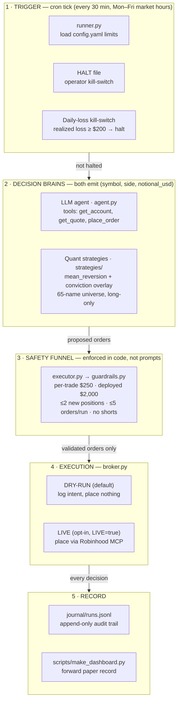

# Big Picture: How the Agent Thinks

Two decision brains — an LLM agent and a quant strategy pipeline — propose
trades, but every order is forced through one code-enforced safety funnel.
**The model decides; the code decides what's allowed.** One cron tick = one run
of `rhagent.runner`.

## 1 · Trigger — cron tick & kill-switches

- **Runner** (`runner.py`) orchestrates one tick: load `config.yaml` limits,
  then run the decision loop.
- **HALT file** — the operator drops a `HALT` file and the run does nothing.
  Checked before anything else.
- **Daily-loss kill-switch** — realized loss today ≥ **$200** → trading halts
  for the day, automatically.

## 2 · Decision brains — two ways to propose a trade

Both emit the same thing: `(symbol, side, notional_usd)`.

**LLM agent (`agent.py`).** A manual agentic loop (Nemotron 49B via NVIDIA's
API) reasons over the live account each tick with three tools:

| Tool | What it does |
|------|--------------|
| `get_account` | buying power, positions, P&L today |
| `get_quote` | latest price for a symbol |
| `place_order` | propose a trade — never touches the broker directly |

**Quant strategies (`strategies/`).** Rule-based, backtested offline, then run
live in "strategy mode". Shipped preset:

- **mean_reversion** — buy 1σ dips vs the 20-day mean, exit at the mean; long-only
- **conviction overlay** — only take entries above the 60th percentile of
  signal strength
- **65-name universe** — prices cached in `data/*.csv`

Market data flows in through the Robinhood MCP (`mcp_session.py` →
`broker.py`, the only code that touches the broker); historical bars are
cached to disk by `data.py`.

## 3 · Safety funnel — OrderExecutor → guardrails

Every order from either brain passes through `executor.py`, which runs
`guardrails.py` first. An order is rejected if it fails any check:

| Check | Limit |
|-------|-------|
| Symbol whitelist | 1–5 uppercase letters only |
| Per-trade cap | $250 |
| Total deployed cap | $2,000 |
| New positions per run | ≤ 2 |
| Orders per run | ≤ 5 |
| Short selling | disabled everywhere by default |

These are enforced in code — the model cannot talk its way past them.

## 4 · Execution — two modes, one adapter (`broker.py`)

- **DRY-RUN (default)** — log the intended order, place nothing. With no MCP
  token, a simulated account stands in, so the whole pipeline runs on paper.
- **LIVE (opt-in)** — only when you explicitly set `LIVE=true`: place via the
  Robinhood MCP and record the fill.

## 5 · Record — audit trail

- **Journal** (`journal/runs.jsonl`) — append-only log of every run: what the
  model saw, what it proposed, what the guardrails said, what happened.
- **Dashboard** (`scripts/make_dashboard.py`) — renders the forward paper
  record: the strategy's live track record without risking a dollar.
